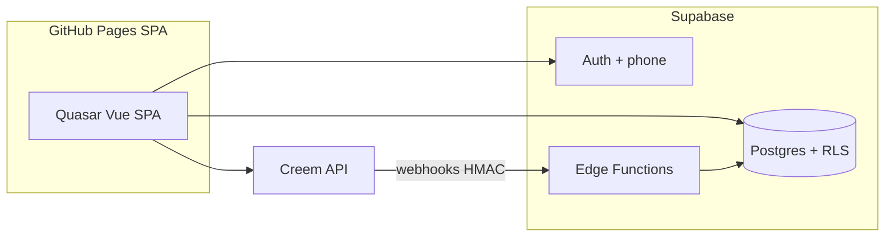
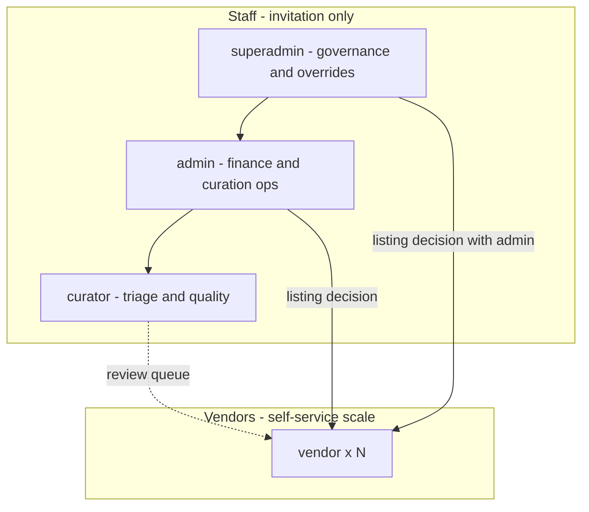
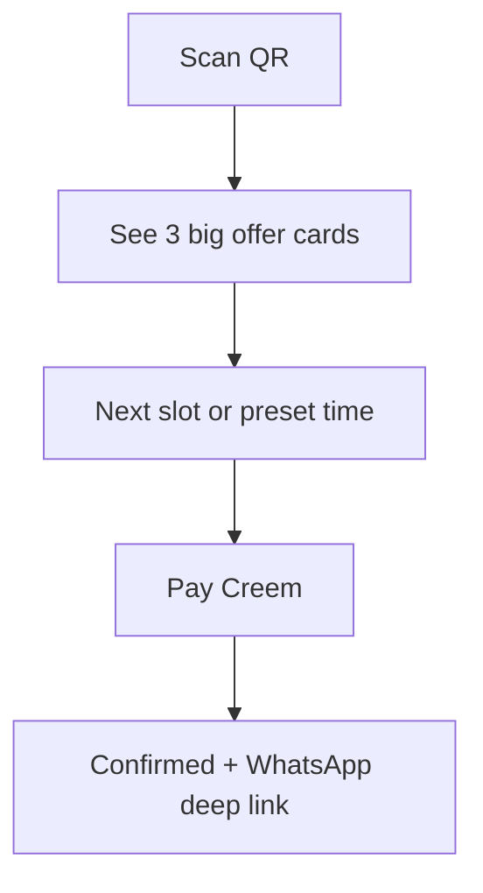
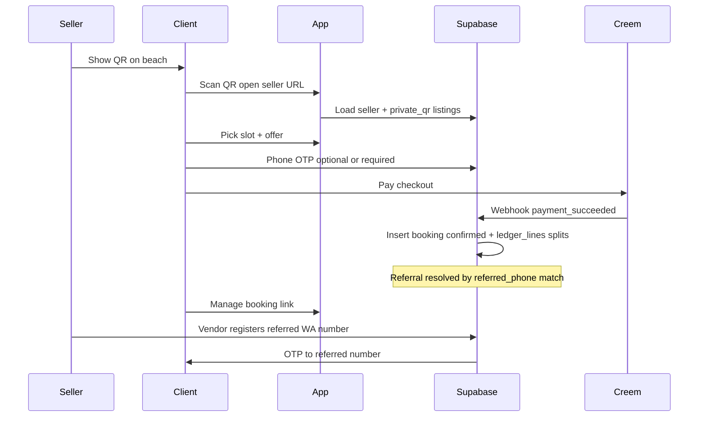
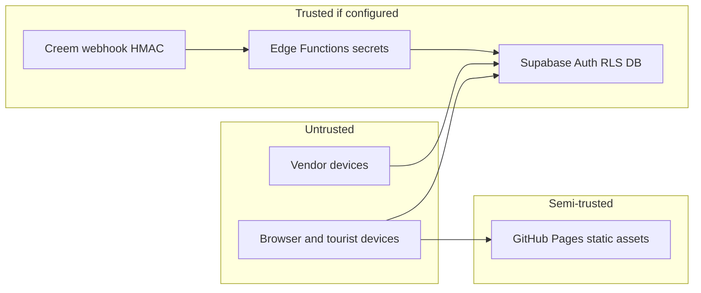
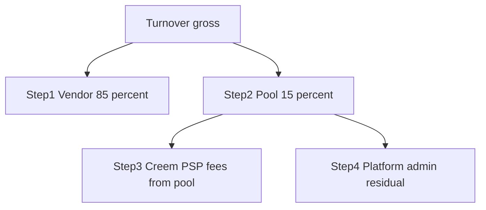
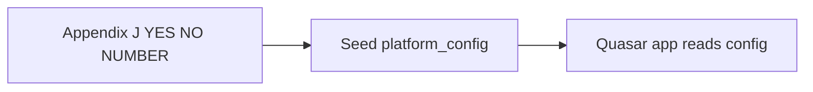

# Mobile-first marketplace (GitHub Pages + Supabase + Creem)

## Architecture



## Staff vs vendor surfaces + role hierarchy

Same Quasar SPA; **staff** routes (`/superadmin/*`, `/admin/*`, `/curator/*`) vs **vendor** routes (`/vendor/*`) so finance and governance never mix with beach conversion UX. **No fixed cap** on how many admin/superadmin accounts you run—scale is a product/ops choice, enforced by **invitation-only** promotion to staff roles (not self-serve).

### Role ladder (high → low)

| Role | Purpose |
| --- | --- |
| **`superadmin`** | Governance “between admins”: invite/promote/demote **admins** and **curators**, override sensitive settings, full finance visibility, audit. **Superadmins + admins** are the only roles that may **decide which offers get listed** (publish/reject, visibility). |
| **`admin`** | Operations: **Creem / gateway**, **per-vendor financial reports**, **revenue splits**, refunds queue, publish/reject listings (with superadmin), vendor disputes. Same **listing authority** as superadmin for day-to-day curation (policy: both can publish, or require dual control—product toggle). |
| **`curator`** | **Known curators** — one step below admin: **triage and quality** (review drafts, flag issues, recommend), **no** access to change **`split_rules`** or gateway secrets unless you explicitly grant a narrow permission. Does **not** replace superadmin/admin on **final listing decision** unless you delegate (default: curators move items to **“ready for decision”**; superadmin/admin publish). |
| **`vendor`** | **Many** accounts; **self-service** registration and content creation with **minimal validated inputs** (see below). QR, storefront, bookings, own earnings slice. |



### Superadmin “decision area”

- Dedicated **`/superadmin/*`** (or top-level section): **staff lifecycle** (who is admin/curator), **split rule overrides**, **audit** of who published what, optional **dual-control** settings (e.g. high-value split changes need superadmin).
- Resolves **conflicts between operator accounts** (policy + UI), not beach UX.

### Who lists what (explicit)

- **Superadmins and admins** control **which offers appear** (transition to `published` / `rejected`, `visibility` for private vs curated). **Curators** feed the queue and notes; they do **not** silently go live without staff approval unless you later add a specific “curator publish” permission.

### Vendor self-service (fast accounts)

- **Self-service signup**: vendor creates account **without** manual staff account setup; **minimal required fields** at registration (e.g. phone OTP, display name, country, accept terms).
- **Progressive profiling**: optional fields after first login (bio, payout info) — still **validated** when entered.
- **Staff onboarding queue** is **optional** (for edge cases); default path is **vendor completes registration → creates draft listing → awaits superadmin/admin approval**.

### Data validation (minimal inputs)

- **Registration**: JSON schema or server checks — E.164 phone, max lengths, allowed characters, no HTML in names.
- **Content creation** (listings, embeds, slots): **required fields only** for MVP (title, price, duration, category); **allowlisted URLs** for embeds; **numeric bounds** on price and capacity.
- Validation in **Postgres constraints** + **Edge Function** on write where RLS is not enough; Quasar forms mirror the same rules for UX.

### “Flawless” = testable guarantees

- **RLS**: Vendors tenant-scoped; curators **read** broad + write **review records** only; admins/superadmins finance tables; superadmin-only mutations for role changes (via Edge Function with checks or `profiles` policies).
- **E2E**: Vendor self-reg → draft → curator note → admin publish → QR book; webhook idempotency.
- **Monitoring**: Creem webhook failures → staff-visible alert list.

## Frontend: Vue.js + Quasar (reference repo)

- **Vue 3** + **Quasar v2** + **Vite** + **Pinia**, aligned with `[/Users/kaiserneptunhuhn/Desktop/Cursor Repo/apps/fzr4.0-vue/package.json](/Users/kaiserneptunhuhn/Desktop/Cursor Repo/apps/fzr4.0-vue/package.json)`.
- **Hosting**: `vite build` → `dist/`; `base` `'/cabarete247/'` for Pages under the org repo.

## Git remote and project home

- **Repository**: [https://github.com/cabaretetwentyfourseven-tech/cabarete247.git](https://github.com/cabaretetwentyfourseven-tech/cabarete247.git)
- **Workspace**: Local folder **`cabarete247`** as Cursor root.

---

## Scenario Storybook analysis (workflow narratives)

Stories map 1:1 to **Storybook** (or **Ladle**) scenarios for implementation QA and design review. **Primary viewport: mobile** (`375×812` baseline); tablet/desktop are progressive enhancement. Each story has **states**: loading / empty / error / success.

### Epic A — Tourist (guest, beach)

| Story ID | Title | Given / When / Then |
| --- | --- | --- |
| **T-01** | Scan QR opens storefront | **Given** a valid `/s/:slug`, **When** page loads on 4G, **Then** seller name + 1–3 offer cards render above fold; no login. |
| **T-02** | Pick offer + slot | **Given** published private offers, **When** user taps card then preset slot, **Then** price + time summary visible; CTA “Pay”. |
| **T-03** | Pay (Creem) | **Given** CTA tapped, **When** Creem opens, **Then** return URL restores context; booking **pending** until webhook. |
| **T-04** | Confirmation | **Given** webhook ok, **Then** confirmation + WhatsApp/deep link + **manage token** (high entropy) copy. |
| **T-05** | Explore curated (opt-in) | **Given** user taps “Explore partners”, **Then** curated list loads; still mobile single column. |

### Epic B — Vendor (self-service, conversion)

| Story ID | Title | Given / When / Then |
| --- | --- | --- |
| **V-01** | Register (minimal) | **Given** phone OTP, **When** submit valid fields, **Then** `vendor` profile; no staff step. |
| **V-02** | Create draft listing | **Given** logged-in vendor, **When** form passes validation, **Then** draft + `pending_review`. |
| **V-03** | Fullscreen QR | **Given** vendor dashboard, **When** “Show QR”, **Then** fullscreen, high contrast, brightness hint; URL copy. |
| **V-04** | Today’s bookings | **Given** bookings exist, **When** open inbox, **Then** list sorted by time; pull-to-refresh. |
| **V-05** | Referral (off-beach) | **Given** vendor, **When** add intl WhatsApp, **Then** pending OTP to referred number. |

### Epic C — Curator (triage)

| Story ID | Title | Given / When / Then |
| --- | --- | --- |
| **C-01** | Review queue | **Given** drafts, **When** open queue, **Then** cards with vendor + flags; no finance columns. |
| **C-02** | Notes + ready flag | **Given** listing, **When** save review, **Then** notes stored; optional `ready_for_decision`. |

### Epic D — Admin (finance + publish)

| Story ID | Title | Given / When / Then |
| --- | --- | --- |
| **A-01** | Publish / reject | **Given** `pending_review`, **When** admin taps publish, **Then** listing live + visibility set + **audit** row. |
| **A-02** | Per-vendor P&L | **Given** date range, **When** filter vendor, **Then** ledger_lines aggregate + export. |
| **A-03** | Split rules | **Given** admin, **When** edit %, **Then** validation sums + audit; optional superadmin override path. |
| **A-04** | Gateway health | **Given** webhooks, **When** failures spike, **Then** alert banner + last error list. |

### Epic E — Superadmin (governance)

| Story ID | Title | Given / When / Then |
| --- | --- | --- |
| **S-01** | Invite staff | **Given** superadmin, **When** promote user, **Then** role updated only via controlled action + audit. |
| **S-02** | Override split | **Given** dispute, **When** superadmin overrides, **Then** audit + reason field. |

### Storybook implementation notes

- **Colocate** stories with Quasar pages or `*.stories.ts` beside components (`OfferCard`, `BookingRow`, `QrFullscreen`, `LedgerTable` mobile).
- **Visual regression**: run against **mobile** screenshot first; tablet breakpoint second.
- **Mock** Supabase + Creem in stories; **no** live keys in Storybook build.

### Responsive design plan (mobile-first)

Authoritative UI spec: [`docs/DESIGN-PLAN-CABARETE247.md`](../DESIGN-PLAN-CABARETE247.md) (this repo). Breakpoints scale **up** from mobile; **no** desktop-only layouts required for v1.

---

## Persona review: kitesurfer on the beach (phone only)

**Context**: Bright sun, salty fingers, wind noise, patchy 4G, patience near zero. Success = **fewest steps** from “I want a lesson / rental / massage” to **paid confirmation**, without assuming a laptop or patience for admin dashboards.

### What already fits this persona

- **QR → one seller** — Tourist scans once; no hunting the full directory. Matches “quick deal with this person right here.”
- **Mobile-first Quasar** — Large touch targets and responsive layout are mandatory; keep primary actions **thumb-reachable**.
- **Private offers default** — Avoids cognitive overload; curated catalog stays **opt-in** (secondary).
- **Link-first** — Seller can share **same URL** in WhatsApp if QR is awkward (sand, wet hands).

### Friction vs “quick deal” (honest)

| Plan element | Kitesurfer risk | Mitigation to bake into UX |
| --- | --- | --- |
| **Draft → admin publish** for every listing | Seller cannot spin up a **same-day** offer if ops is slow | **Fast-lane**: trusted sellers auto-publish, or **admin SLA** (same day); offer **“quick listing”** template (price, duration, spots) with one tap duplicate |
| **Phone OTP for tourist** before booking | SMS delays, roaming, drop-off | Prefer **guest checkout**: collect phone **after** Creem success or use **email-less pay link**; verify phone only when needed for **referral** or **disputes** |
| **Creem redirect** | Extra tabs, bank 3DS, beach glare | Use **mobile-optimized** checkout; show **clear “return to app”**; keep booking **pending** until webhook confirms |
| **Referral + OTP to international number** | Heavy flow; not “beach quick” | Treat referral as **seller downtime** flow (evening), not part of **on-sand** booking path |
| **Slot picking UX** | Calendar widgets are fiddly on sand | Default to **“next available”** + **few preset slots** (morning/afternoon); advanced calendar secondary |
| **No signal at scan** | QR opens nothing | **Seller phone**: show **large `wa.me` + copy link** on seller dashboard; optional **Add to Home Screen (PWA)** for repeat sellers |

### Minimal “beach happy path” (target UX)



- **Tourist**: scan → tap offer → tap time → pay → **done** (ideally **≤ 5 screens** excluding payment provider).
- **Seller (kitesurfer)**: open app → **show QR fullscreen** (brightness boost) → see **today’s bookings**; add referral **later**, not between sets.

### Plan gaps this persona exposes

1. **Guest booking identity** — If Supabase Auth requires login for every booking, the beach flow breaks. Plan should allow **`bookings` with guest email/phone** + magic link to manage, or **session-only** manage link in post-payment screen.
2. **Operational latency** — Admin approval must not block **same-day wind**. Product needs either **pre-approved sellers** or **SLA**.
3. **PWA** — Not in todos yet; **Add to Home Screen** helps the seller who lives on the phone. Optional **offline splash** (“Open when online”) for QR page cache.
4. **Seller QR on phone**: **Fullscreen QR** + **invert colors** for sun readability (UI detail).

### Phasing tweak (persona-aligned)

- **Beach-critical path first**: QR storefront → private listings → **guest-friendly** booking → pay → confirmation + WhatsApp.
- **Defer** heavy referral onboarding flows to **M2+** or **evening UX**, not the default sand path.

---

## Beach QR → private offers (core funnel)

- **Intent**: Seller on the beach shows a **QR code**; tourist scans and lands in **that seller’s** booking experience to see **private offers** (seller’s bookable items), schedule, and pay — not the whole island catalog by default.
- **QR payload**: Encode a **stable HTTPS URL** (GitHub Pages) such as  
  `https://cabaretetwentyfourseven-tech.github.io/cabarete247/s/{sellerSlug}`  
  Optionally append `?t={signed_short_token}` if you need **non-guessable** links (token verified by Edge Function or validated via HMAC in client + server rule). For v1, **slug + rate limits** may suffice; add signed tokens if slugs are scraped.
- **Private offers**: Listings carry **`visibility`**: e.g. `private_qr` (only from seller storefront/QR context), `curated` (eligible for directory), `draft` / `pending_review` / `rejected` as before. **RLS**: `private_qr` rows readable only when `seller_id` matches the storefront route **or** authenticated customer has an active booking with that seller (tune as needed).
- **Curated catalog (“whole list”)**: Shown **only when the user explicitly opts in** (button: “Explore all partners” / “See curated offers”) so the default QR path stays **seller-private**. That opt-in can set a session flag or route `/explore`.

---

## Referral: vendor adds international client WhatsApp → cut on bookings

- **Business rule**: A **vendor** (seller A) enters a **new international client WhatsApp number** (E.164). If that number later **books** (and pays), **seller A** earns a **referral cut** in addition to the **service seller’s** share and **platform** fee — per configurable **`split_rules`**.
- **Data**: Table e.g. **`referral_registrations`**: `referrer_seller_id`, `referred_phone_e164` (normalize + unique per referrer or globally — product choice), `status` (`pending_confirmation` / `active` / `void`), `created_at`, optional `confirmed_at` when referred user verifies OTP.
- **Fairness / fraud controls (required)**:
  - **Confirmation**: Referred phone receives **OTP** (SMS/WhatsApp Business later); attribution becomes **`active`** only after verify — reduces fake numbers.
  - **Attribution window**: e.g. first booking within N days, or “until revoked.”
  - **Conflict policy**: If two vendors claim same number, **first verified** or **admin arbitration** — document rule.
  - **Self-dealing**: Block referrer = service seller on same booking if you want stricter fairness (configurable).

---

## Revenue splitting (fair booking + settlement)

- **`split_rules`** (platform-configurable, admin-editable): default **hypothetical** policy — **85% turnover to service vendor**, **15% pool** split **stepwise** between **Creem/PSP fees** and **platform (admins)** — see **§ Appendix G**. Referrer (if any) per **`split_rules`** override.
- **`ledger_lines`** (or extend `ledger_entries`): For each Creem `payment_succeeded` event, insert **one row per payee** (platform, seller, referrer) with amounts in minor units + currency; **sum equals** charged amount net of processor fees per your accounting rule.
- **Creem reality check**:
  - **Ideal**: Creem supports **split payouts** or **application fees** so settlement matches ledger automatically — **must be validated against current Creem docs** (product name may be Connect / marketplace).
  - **Fallback**: Single Creem charge to **platform merchant of record**; **ledger_lines** record owed amounts; **manual or scheduled payouts** (bank/Binance) to sellers — **higher operational and legal burden** (you hold funds briefly). Plan must **not** promise automatic seller payouts until Creem (or banking partner) supports your chosen model.

---

## End-to-end deal process (pressure test)



| Stage | What the plan must deliver | Status |
| --- | --- | --- |
| Discovery | QR → seller route; optional signed token | In plan |
| Trust | Phone OTP sellers; customers OTP for referral + optional booking | In plan |
| Catalog | Private default; curated opt-in | In plan |
| Schedule | Slots + bookings + timezone | In plan |
| Pay | Creem checkout + webhook | In plan |
| Split | `ledger_lines` + Creem capability or manual payout path | **Needs Creem product confirmation** |
| Referral payout | Attribution + anti-fraud + line items | In plan |
| Disputes / refunds | **Not fully specified** — add policy + Creem refund webhook handling | Gap |
| Tax | Creem MoR docs + local rules | Partial |
| Reporting | Dashboard + exports per role | Partial |

---

## Listing lifecycle (by role)

- **Vendor**: creates **draft** / submits for review (`pending_review`) — fields constrained by **content validation** rules.
- **Curator**: reviews, **flags**, internal notes, optional status **`ready_for_decision`** (naming flexible); **does not** publish unless product grants it.
- **Superadmin + admin**: **only roles that decide public listing** — **publish** or **reject**; set **`visibility`** (`private_qr` vs `curated`). Optional **fast-lane** vendor (staff-set) for auto-publish after validation passes.

## Link-first + phone

- Share URLs for listings/vendors; **bookings** remain central.
- **Phone**: Vendors verified; customers guest-first per beach UX; referral confirmation separate.

## Creem: checkout, ledger, dashboard, tax

- Webhook → booking confirmation + **`ledger_lines`**.
- **Admin**: gateway status, reconciliation, **per-vendor** financial exports, tax/report handoff.
- **Vendor**: optional link “Open my Creem” **only if** Creem model gives per-vendor merchant — else vendor sees **in-app earnings summary** derived from **their** `ledger_lines` (no platform-wide totals).

## Staff responsibilities (by layer)

**Superadmin + admin (finance + listing authority)**

1. **Payment gateway** — Creem, webhooks, refunds (admins/superadmins per RLS).
2. **Per-vendor financial reports** — `ledger_lines`, exports.
3. **Revenue splits** — `split_rules` + audit (superadmin may override).
4. **Which offers get listed** — Publish/reject, visibility, referral arbitration on disputes.

**Superadmin-only (governance)**

- Promote/demote **admins** and **curators**; audit trail; sensitive overrides.

**Curator (quality, no finance by default)**

- Triage incoming drafts, consistency with **minimal input** standards, route junk before staff decision.

## Vendor responsibilities (prioritized)

1. **Self-service** — Register fast, minimal validated fields, submit drafts.
2. **Conversion** — Guest booking path, QR, today’s bookings, `wa.me` fallback.

## Data model (delta)

| Area | Purpose |
| --- | --- |
| `profiles` | `role` = `superadmin` \| `admin` \| `curator` \| `vendor`; staff roles **invitation-only** (no self-assign). |
| `listings` | `vendor_id`, `visibility`, `base_price`, currency, status; validation constraints. |
| `listing_reviews` | Optional: curator notes, `ready_for_decision` flag. |
| `referral_registrations` | Referrer vendor, referred phone, status, timestamps. |
| `split_rules` | Default **8500 bps** vendor (85%) + **1500 bps** pool for PSP then platform — **superadmin + admin** write; see **§ Appendix G**. |
| `ledger_lines` | Reporting for staff; vendors see **own** lines only. |
| `bookings` | `referral_registration_id` nullable; `creem_payment_id`. |
| `audit_log` | Staff actions: publish/reject, split changes, role promotions. |

Indexes: `referral_registrations(referrer_vendor_id, referred_phone_e164)` unique where active; `listings(vendor_id, visibility)`; `ledger_lines(payee_id, created_at)` for reports.

## Repo layout

- **`/superadmin/*`** — Governance, role management, overrides, audit.
- **`/admin/*`** — Finance, gateway, per-vendor reports, splits, **publish/reject** listings.
- **`/curator/*`** — Review queue, triage, notes (no splits unless extended).
- **`/vendor/*`** — Self-service, QR, drafts, bookings, referrals; **no** staff finance.
- **Public** — `/s/:slug`, guest booking, explore curated.

## Security (baseline)

- **RLS**: Vendors tenant-scoped; **curators** no `split_rules` / gateway secrets; **admins + superadmins** financial reads; **superadmin** (or Edge Function) for role promotion; listing **publish** policies allow **superadmin + admin** only.
- **CAPTCHA** on public registration/booking if abused.
- **Vendor** routes: only “my earnings” aggregate, not platform totals.
- **Service role key**: Edge Functions and CI only — never in the SPA or repo.

---

## Security audit and red team (plan review)

This is an **adversarial review** of the **planned** architecture (static SPA + Supabase + Creem + Edge Functions). It is **not** a substitute for a full pentest after implementation.

### Trust boundaries and assets



**Critical assets**: `ledger_lines`, `split_rules`, staff `profiles.role`, Creem webhook secret, guest **booking management tokens**, vendor PII, OTP delivery.

### Attack surface summary

| Surface | Risk theme |
| --- | --- |
| **Public SPA + anon key** | Anyone can call PostgREST; **all authorization must be RLS**, not UI hiding. |
| **Self-service vendor signup** | **Privilege escalation** if `role` writable or trigger missing. |
| **Guest bookings** | **IDOR** on manage links if tokens are short/guessable; session fixation. |
| **QR / seller slug URLs** | **Enumeration**, **phishing** (fake site with same UI), **open redirect** if you add `?next=`. |
| **Embeds** (TikTok/IG/…) | **XSS** if URLs rendered unsafely; **clickjacking** in iframes. |
| **Creem webhooks** | **Replay**, **forged** payloads without crypto verify, **race** with client callback. |
| **Referral + SMS OTP** | **OTP brute force**, **SMS pumping** (cost DoS), **SIM swap** (out of band). |
| **Staff accounts** | **Session hijack**, **no MFA** in plan; **insider** curator→admin if RLS wrong. |
| **GitHub Actions → gh-pages** | **Supply chain**: compromised dependency or leaked **Actions secret** deploying malware bundle. |

### Red team scenarios (how an attacker wins)

1. **Vendor A reads Vendor B’s bookings and customer phones** — Bypass RLS via malformed JWT, `or` in filter, or missing policy on `bookings` join. **Test**: every table with `vendor_id` must have **deny-by-default** policy tests.
2. **Vendor sets `role = superadmin`** on own profile — Direct `update profiles` if column writable. **Mitigation**: `role` changes **only** via Edge Function + existing superadmin JWT, or DB trigger rejecting client role writes.
3. **Replay Creem webhook** — Double-pay ledger and double-confirm booking. **Mitigation**: idempotency on `creem_event_id` + unique constraint; **constant-time** HMAC compare.
4. **Forged webhook without secret** — Attacker POSTs fake `payment_succeeded`. **Mitigation**: verify signature on **Edge Function only**; **no** client-trusted payment state.
5. **Guest manages someone else’s booking** — Guess short token in URL. **Mitigation**: **128+ bit** unguessable token, single-use or scoped; rate-limit lookups.
6. **Phishing** — Copy GitHub Pages UI at typosquat domain; harvest OTPs. **Mitigation**: user education, **bookmark official domain**, future **app attestation** (hard).
7. **Embed XSS** — Listing title/description renders HTML. **Mitigation**: **escape** all text; **DOMPurify** if any rich text later; CSP `default-src`.
8. **SMS pumping** — Trigger mass OTP sends to burn budget / harass. **Mitigation**: **rate limit** per IP + per phone + CAPTCHA on send; anomaly alerts.
9. **Curator escalates to admin** — API abuse if one RPC forgets role check. **Mitigation**: **defense in depth**: RLS **and** Edge Function checks; audit log on role reads/writes.
10. **Dependency compromise** — Malicious npm package steals Supabase session. **Mitigation**: lockfile, `npm audit` / OSV in CI, minimal deps, Subresource Integrity for CDN scripts if any.

### Findings (severity for implementation phase)

| Severity | Finding | Mitigation in build |
| --- | --- | --- |
| **Critical** | RLS mistake = total data breach | Policy tests in CI (`pgTAP` or Supabase test harness); deny default; external review of policies. |
| **Critical** | Webhook without strong verify | HMAC + idempotency + no trust of client payment alone. |
| **High** | Profile `role` writable from client | Server-only role promotion; triggers block updates. |
| **High** | Guest token entropy | Cryptographic random tokens; server-issued only. |
| **High** | Staff session without MFA | Enforce **Supabase MFA** or IdP for staff emails if you add email login for staff. |
| **Medium** | XSS via listings/embeds | Escape, CSP, allowlist embed domains. |
| **Medium** | Slug enumeration | Rate limit public reads; optional signed QR tokens for high-risk vendors. |
| **Medium** | Creem redirect/open redirect | Validate return URLs against allowlist. |
| **Low** | Timing side channels on webhook | Constant-time compare for HMAC. |

### Security testing (definition of done)

- **Automated**: RLS tests per role; webhook replay test; dependency scan in CI.
- **Manual periodic**: Pentest on staging with test keys; review Supabase **Auth** settings (leaked password protection, etc.).
- **Operational**: Alerts on webhook error rate, failed OTP spikes, unusual `ledger_lines` volume.

### Plan deltas implied by this audit

- Add **`security-rls-audit`**, **`security-webhook-creem`**, **`security-client-hardening`** todos (see frontmatter).
- Treat **CSP**, **token design for guest bookings**, and **role immutability** as **M1/M2** requirements, not post-launch hardening only.

## Phased delivery (revised — payments & reports first)

1. **M1**: Roles (four-tier) + **vendor self-service** + **minimal validation**; **`/admin`** + **`/superadmin`** shell; **minimal checkout path** (test listing or stub) to prove browser → Creem → return URL; **`/vendor`** stub (no full QR polish yet).
2. **M2 (priority — payments & reports):** **Creem** checkout (sandbox → prod); **Edge Function** webhooks ([signature verify per Creem](https://docs.creem.io/skills/creem-api/WEBHOOKS)); idempotent **`ledger_lines`**; handle **`refund.created`** / **`dispute.created`** where applicable; **admin/superadmin** per-vendor P&L + exports + **`split_rules`** UI; **vendor** “my earnings” slice; gateway health view.
3. **M3**: **Bookings** + slots + **guest** flow; **curator** triage; **superadmin/admin** publish/reject; **`/vendor`** fullscreen QR + storefront completion; beach UX pass.
4. **M4**: Referral OTP; **audit_log** polish; governance; full **QA matrix**.

---

## Holes and open gaps (updated)

1. **Guest booking identity** — Beach users won’t tolerate login walls; need **guest checkout** + manage link (see **Persona review**).
2. **Staff invitation security** — Superadmin promotion must be **air-gapped** (bootstrap first superadmin via DB, then UI invites only); guard against compromised staff accounts with **MFA** policy (outside app scope but ops requirement).
3. **Who publishes when both superadmin and admin exist** — Default: **either** can publish; optional **dual approval** for first listing per vendor — product toggle not yet specified.
4. **Curator vs admin boundary** — If curators gain “publish” later, RLS must be updated; default keeps **publish** on superadmin+admin only.
5. **Admin latency vs same-day wind** — **Fast-lane** or validation-only auto-publish for trusted vendors still applies.
6. **Creem multi-party settlement** — Confirm Creem capabilities for splits; else manual payout risk.
7. **Refunds / chargebacks** — Webhook for refund must **reverse or adjust** `ledger_lines` and booking state.
8. **International SMS cost** — Keep referral OTP off sand path; budget SMS.
9. **QR offline** — `wa.me` + copy link fallback.
10. **Referral economics** — Spell out in **`split_rules`** and terms.

### Additional holes (readiness review — poke more)

11. **M2 before M3 ordering** — Payments/reports **before** full booking/slots means **stub bookings** or **test SKUs**; risk of **ledger semantics** that don’t match real `bookings` rows later. **Mitigation:** define **`booking_id` nullable** on ledger with migration path, or **feature-flag** “real booking” only after M3.
12. **85/15 vs Creem fees** — Appendix G constraint: **small tickets** can make `platform_net` negative; **no** automated **minimum order value** in plan yet.
13. **Data retention & GDPR** — How long **guest phone/email** and **ledger** are kept; **export/delete** path for subjects — not specified.
14. **DR / backups** — Supabase **PITR**, restore drill, **Edge Function** redeploy — ops runbook missing.
15. **Multi-currency** — Tourist cards vs **DOP/USD** display; **FX** only display vs settlement — hole for finance.
16. **Vendor offline** — Realtime/polling useless without network; **terminal mode** must degrade (show last sync, queue actions).
17. **Dual-hat users** — If a **staff member is also a vendor**, RLS + conflict of interest — not modeled.
18. **Abuse / cost** — Public **OTP**, **webhooks**, **PostgREST** — **rate limits** and **budget alerts** on Supabase/Creem — partially in security audit, not ops budget.
19. **i18n** — DR market likely needs **Spanish + English**; plan assumes one locale.
20. **Email deliverability** — Magic links / notifications landing in **spam** — no SPF/DKIM plan (depends on sender domain).
21. **Chargeback reserve** — Platform may need **rolling reserve** per PSP rules — not in financial model.
22. **Vendor exit** — Final payout, **negative balance**, **dispute window** after last booking — not specified.
23. **Staging parity** — **Creem sandbox** + **Supabase branch** + **GitHub Pages preview** — single **staging URL** for QA not locked.
24. **On-call / incidents** — Webhook failures, payment outages — **pager** vs “check dashboard Monday.”
25. **Accessibility** — WCAG target level for public booking — not committed (design plan mentions baseline a11y only).

**Readiness verdict:** **Ready to start M1** (scaffold, auth, shells, stub checkout) **if** Creem sandbox + Supabase project exist. **Not ready to promise production money** until Appendix A sign-off, **§ G** fee edge cases modeled, and **refund/dispute** handlers tested. The holes above are **normal** for a pre-build plan — track in backlog, don’t block first commits.

---

## Risks / constraints

- Holding funds without a licensed payout partner is legally sensitive — prefer **Creem-native splits** or clear **manual settlement** terms with counsel.
- Legal: referral programs may need **disclosure** and **tax** handling per jurisdiction.

---

## Platform management audit (pre-build consolidation)

Single checklist to align **engineering**, **operations**, and **governance** before writing production money paths. Pass/fail is **per row**; do not ship **production** Creem charges until **Money & Creem** + **Appendix A Go/No-Go** are green or explicitly risk-accepted. **Payments/reports slice is M2** (not deferred to old M3).

| Dimension | What the plan already specifies | Pre-build action |
| --- | --- | --- |
| **Product surfaces** | Staff routes vs `/vendor/*` vs public storefront; four roles | Freeze route map; confirm curator cannot publish by default |
| **Tech stack** | Quasar, Supabase RLS, Edge Functions, GitHub Pages | Confirm Supabase project region, branching, backup policy |
| **Identity & access** | Phone OTP, invitation-only staff, RLS by role | Bootstrap superadmin; staff MFA policy (ops) |
| **Money & Creem** | Webhooks, `ledger_lines`, splits, appendix below | **§ Appendix A** research run — see **status 2026-04-02** in appendix; account-specific terms in Creem Dashboard |
| **Operations** | Payout cadence, refund matrix, disputes, notifications (appendix) | Assign **dispute owner** (admin); pick **notification** channels (in-app min) |
| **Security** | Red-team section, CSP, guest tokens | RLS automated tests in CI before launch |
| **UX** | Mobile-first, Storybook scenarios, beach persona | Visual QA at 375px for T-01–T-05 stories |
| **Compliance** | Risks section; MoR vs marketplace | Counsel review vendor terms + referral disclosure |

### Go / No-Go gates (recommended)

- **Before M1:** Supabase project + GitHub repo `cabarete247`; design doc copied into `docs/`; role bootstrap documented.
- **Before payments & reports slice (priority track):** See **§ Appendix A — Go/No-Go** — Creem sandbox webhooks verified; Edge Function signature + idempotency; refund/dispute events mapped; product + finance sign-off on internal payout policy.

**Build order (product decision):** **Payments and admin/vendor financial reports run before** full booking/curation depth — implement Creem + `ledger_lines` + reporting UI early (**revised phases** below); bookings/slots and curator publish follow.

### Traceability map

```mermaid
flowchart TB
  tech [Tech: SPA RLS Edge Creem]
  ops [Ops: payouts refunds disputes notify]
  gov [Governance: roles audit splits]
  tech --> ops
  gov --> tech
  ops --> gov
```

---

## Appendix: Operations & money (product + ops)

**Purpose:** Bridge technical design (Creem, webhooks, `ledger_lines`) with marketplace **operations**: when money moves, how refunds/disputes are owned, what vendors and staff are told, and what must be **confirmed with Creem** before promising behavior.

### A. Creem confirmation (checklist run — public docs, 2026-04-02)

*Validate your **specific** contract, regions, and fee tier in **Creem Dashboard**; below is what public documentation commonly states.*

| Item | Doc-backed finding | Status | Your sign-off |
| --- | --- | --- | --- |
| **Webhooks & signature** | Register URL in Dashboard; verify **`creem-signature`** as **HMAC-SHA256** hex; use **timing-safe** compare. Retries: backoff (e.g. 30s → 1m → 5m → 1h) on non-200; failed events can be resent from Dashboard. See [Creem WEBHOOKS API](https://docs.creem.io/skills/creem-api/WEBHOOKS). | **Pass** for engineering pattern | [ ] |
| **Event types** | Docs list events such as **`checkout.completed`**, subscription lifecycle events, **`refund.created`**, **`dispute.created`** (exact set may evolve — confirm under Developers → Webhooks / [event types](https://docs.creem.io/learn/webhooks/event-types)). | **Pass** — map these in Edge Function | [ ] |
| **Splits** | Creem documents **revenue splits** for multiple recipients; **splits feature may incur an additional fee** (public material references ~**2%** on split flows — **confirm current % in Dashboard**). See [splits introduction](https://docs.creem.io/learn/splits/introduction). | **Conditional** — fee + recipient rules per account | [ ] |
| **Payouts to bank** | [Payouts](https://docs.creem.io/finance/payouts): net sales (after taxes/platform fees) paid to **your** bank per Creem schedule; limits/schedules in Dashboard. | **Conditional** — not the same as “per-vendor Connect” unless product offers it | [ ] |
| **Charge model (MoR)** | Creem positions as **merchant-of-record / platform** style offering in their materials; **per-vendor sub-merchants** must be confirmed if you need separate vendor dashboards/tax — **open with Creem support**. | **Needs account confirmation** | [ ] |
| **Refunds / disputes** | **`refund.created`** and **`dispute.created`** events exist for webhook-driven ledger reversals — implement handlers before prod. | **Pass** for event-driven design | [ ] |
| **Reporting** | Combine **Creem Dashboard** exports + **internal `ledger_lines`** for per-vendor views if Creem is single merchant account. | **Pass** for hybrid reporting approach | [ ] |

#### Appendix A — Go / No-Go (before production payments)

| Gate | Criterion |
| --- | --- |
| **GO — engineering** | Sandbox webhook delivers signed payload; Edge Function verifies HMAC, **idempotent** insert on `creem_event_id`, test **`checkout.completed`** → `ledger_lines`. |
| **GO — refunds** | Test **`refund.created`** (or equivalent) updates/cancels ledger rows in sandbox. |
| **GO — ops** | Payout cadence (§B) + refund matrix (§C) signed by product/finance **for your jurisdiction**. |
| **NO-GO** | Splits % / payout schedule unknown; no sandbox success; counsel blocks MoR terms. |

**Run result:** Public docs support **webhook-first money architecture**, **splits** as a feature (with extra fee — verify), and **payouts** to platform bank. **Per-vendor automatic settlement** is **not** fully confirmed from snippets alone — use Dashboard + Creem support for marketplace-style multi-vendor payouts vs manual **`ledger_lines`** + off-platform payout.

### B. Payout cadence (default policy)

| Concept | Default proposal | Notes |
| --- | --- | --- |
| **Accounting truth** | `ledger_lines` + Creem events | Single source after webhook confirmation |
| **Vendor-visible balance** | Owed lines minus paid batches (if manual payout) | If Creem pays vendors directly, link or embed status |
| **Cadence** | Weekly settlement (e.g. Mon 00:00 UTC) or Creem native | Weekly for small ops; daily if volume high |
| **Minimum payout** | Optional floor (e.g. $50) | Reduces fees and micro-transfers |
| **Failure** | Retry N times; then admin queue + vendor message | |

### C. Refund matrix

| Scenario | Initiator | Owner | System actions |
| --- | --- | --- | --- |
| Customer cancel before service | Customer/vendor | Vendor first; admin if dispute | Cancel/refund pending; Creem refund; ledger adjust on webhook |
| No-show | Vendor | Vendor (default) | Partial/no refund per policy; ledger adjust |
| Chargeback | PSP | Admin | Freeze lines; manual resolution + audit |
| Wrong amount | Anyone | Admin | Partial refund; ledger correction |
| Referral dispute | Vendors | Admin/superadmin | Hold referral line; audit_log |

**Rule:** No client-only “refunded” state; **Creem webhook** or **admin-audited** exception drives financial truth.

### D. Disputes (admin vs automated)

| Tier | Owner | Behavior |
| --- | --- | --- |
| Policy | Product | Published cancellation/no-show windows |
| Vendor–customer | Vendor + buyer | Optional ticket; may be WhatsApp |
| Escalated | Admin | Refunds, split exceptions, chargebacks |
| Governance | Superadmin | Split overrides, bad-faith vendor |

**Automation:** Auto full refund only when inside policy window **and** Creem allows unattended refund; else pending admin.

### E. Minimum notification events (v1)

**Vendor:** listing submitted / published / rejected; new booking; cancellation; payout done or failed.

**Customer:** confirmation after webhook; refund confirmed (when applicable).

**Staff:** webhook failures; chargeback; refund failure; optional dispute ticket.

Channels: in-app + email for staff; vendor SMS optional; WhatsApp not system-of-record.

**Gap (filled in § H):** § E alone does **not** define a **vendor terminal** surface or **messenger product integration** — see **§ H** for terminal mode, push/realtime, and phased Telegram/WhatsApp.

### F. Open items (ops workshop)

1. Cancellation windows per vertical (lesson vs massage).
2. Currency display vs settlement currency.
3. Tax wording on receipts (Creem MoR vs platform).

### G. Hypothetical revenue split (vendor-first — 85% / 15%)

**Policy goal:** **85% of turnover** to the **service vendor** (favors vendors). The **remaining 15%** is allocated **step by step** to **payment infrastructure (Creem / PSP)** and **platform (admins)** — not a single lump to “the house” without transparency.

**Definitions**

- **Turnover:** Gross successful payment amount for a booking (customer charged), in settlement currency, as reported on **`checkout.completed`** (or equivalent) before internal adjustments.
- **Service vendor:** The vendor who fulfills the listing (not the referrer, unless product merges them — default: referral is a separate `ledger_lines` row from **referrer’s** share of **policy**, see below).

#### Step-by-step waterfall (apply in order on each eligible payment)

1. **Vendor primary entitlement — 85% of turnover**  
   - `vendor_share_gross = round(turnover * 0.85)` (minor units; define rounding rule — **banker’s rounds** or **floor** — in code and contract).  
   - Book **`ledger_lines`**: `payee_type = vendor`, `payee_id = service_vendor_id`, `amount = vendor_share_gross`.

2. **Residual pool — 15% of turnover**  
   - `platform_pool = turnover - vendor_share_gross` (should equal 15% if rounding consistent).  
   - This pool funds **PSP/Creem** allocation and **platform (admins)**.

3. **Payment infrastructure (Creem / PSP) — paid from the 15% pool first**  
   - Ingest **actual** Creem charges for the transaction: processing %, fixed fee, **splits fee** if using Creem splits, MoR fee lines — from webhook payload or fee schedule table (**do not guess**; use Creem-reported or contracted bps).  
   - `psp_total = sum(creem_fee_lines)` capped at **`platform_pool`** (see **Constraint** below).  
   - Book **`ledger_lines`**: `payee_type = psp` or `creem`, `amount = psp_total`.

4. **Platform (admins / operations) — residual of the 15% pool**  
   - `platform_net = platform_pool - psp_total` (must be **≥ 0**).  
   - Book **`ledger_lines`**: `payee_type = platform`, `amount = platform_net`.  
   - This is what funds admin operations, curator tooling, support — **not** mixed with vendor lines.



#### Constraint (must validate before promising 85/15)

If **`psp_total > platform_pool`** (e.g. small ticket + high fixed fee, or Creem+splits fees spike), **arithmetic breaks**: you cannot take full Creem cost out of 15% without **reducing the vendor share** or **subsidizing from platform equity**. **Pre-launch:** model **minimum order value** or **fee caps**; add **alert** in admin if `platform_net < 0` on a payment.

#### Referrals (orthogonal)

If a **referral cut** applies, policy choice: (a) deducted from **vendor’s 85%** slice, (b) from **platform_net**, or (c) separate bps on turnover — document in **`split_rules`** and mirror in **`ledger_lines`** so sums still reconcile to turnover.

#### `split_rules` storage (hypothetical)

| Key | Example value |
| --- | --- |
| `vendor_bps` | `8500` (= 85.00%) |
| `platform_pool_bps` | `1500` |
| `psp_fee_source` | `creem_webhook` \| `static_schedule` |
| `rounding` | `floor_minor_units` |

**Reporting:** Admin dashboard shows **turnover**, **85% vendor line**, **Creem/PSP lines**, **platform residual** — same waterfall for finance sign-off.

### H. Vendor terminal, notifications, and messenger integration

**Does the plan include this already?** Only partially: **§ E** lists **channels** (in-app, email, SMS optional) but **not** a dedicated **vendor terminal** UX or **messenger** APIs. This section **adds** that product/tech intent.

#### Vendor “terminal” (in-app, not a separate OS)

| Layer | Behavior |
| --- | --- |
| **Primary** | Same Quasar SPA — **`/vendor/*`** with **notification center** (list + unread counts), **Supabase Realtime** or short polling on `bookings` for the logged-in vendor. |
| **Terminal / kiosk mode** | Optional query **`?terminal=1`** or saved setting: **fullscreen** QR + **today’s bookings**, larger typography, optional **Web Audio** chime on new booking (user gesture to unlock audio on iOS). For a **physical tablet** on a stand — still the web app. |
| **Push** | **Web Push** (service worker) optional v1.5; **native** app not in scope. |

#### Messenger integration (phased — do not block M2)

| Phase | What ships | Role |
| --- | --- | --- |
| **v1 (current plan)** | **`wa.me` / `tg://` / Signal** deep links with **prefilled message** including **stable booking id** — **no** Meta/Telegram server APIs. | Conversion + coordination off-platform. |
| **v2** | **Outbound** alerts via **Twilio** (SMS/WhatsApp) or **Telegram Bot API** from **Edge Function** (new booking → vendor phone). Requires templates, rate limits, consent. | True “messenger integration” for notifications only. |
| **v3** | **Inbound** webhooks (customer replies) — high complexity; only if product needs **threaded** support inside platform. | Optional. |

**Security:** Messenger bridges are **not** E2E under your control; **booking truth** stays in **Supabase** + **Creem**; chat is **adjunct**.

### I. Stable booking links and secure subdomains

**Stable links (required for client ↔ vendor coordination):**

- **Public booking detail / manage:** `https://{primary_host}/b/{booking_public_id}` where `booking_public_id` is a **non-guessable** id (**ULID/UUID**), not sequential integers.
- **Privileged actions** (cancel, reschedule): require **`manage_token`** — either **`/b/{id}/manage?t={token}`** (short-lived) or **POST** exchange from email/SMS magic link; **never** rely on id alone.
- **QR and marketing** can encode the same **stable** `https://.../b/...` or vendor storefront `.../s/{slug}` — **one canonical URL** per booking in confirmation emails/push text.

**Subdomains (branding + separation; “secure” = TLS + token gates, not E2E crypto):**

| Pattern | Use | Notes |
| --- | --- | --- |
| **Path-only** | `cabarete247.com/b/...` | Simplest on **GitHub Pages** custom domain; single CSP. |
| **`book.` subdomain** | `book.cabarete247.com/b/...` | **DNS A/CNAME** to GitHub Pages or Cloudflare; same SPA, **router** base or host redirect. Improves trust UX (“official booking”). |
| **`app.` for vendor/staff** | optional | Same SPA; role routes; optional **auth cookie scope** `Domain=.cabarete247.com` if subdomains share cookies (careful with XSS — prefer **path** + **SameSite**). |

**Implementation notes:**

- **GitHub Pages:** supports **one custom domain** + **www**; multiple subdomains often need **DNS** + **CNAME** per [GitHub docs](https://docs.github.com/en/pages/configuring-a-custom-domain-for-your-github-pages-site) or move **frontend** to **Cloudflare Pages** for wildcard `*.cabarete247.com`.
- **“Secure communication”** between client and vendor on a **booking page** means: **HTTPS**, **auth or token** for manage actions, **RLS** on data — **not** encrypted chat unless you add **in-app messaging** (future). Subdomains help **phishing resistance** (clear official host) when combined with **branding** in WhatsApp messages.

### J. Decision questionnaire — **YES / NO / NUMBER** only (finalizes the plan)

**Purpose:** Every **open question** is answered with **YES**, **NO**, or a **NUMBER** (and a few **PICK** items where three options exist). This **is** the finalize-the-plan flow — not engineering config keys first.

**How to use:** Fill **Your answer** for each ID. **PICK** rows: write `1` / `2` / `3` as defined in the row. Free text only in **Notes** when unavoidable (e.g. Creem screenshot ref). **Blockers** for prod money: **B** + **D** + **F**.

#### A. Product & governance

| ID | Question | Type | Your answer | Notes |
| --- | --- | --- | --- | --- |
| A1 | Will **both** superadmin **and** admin be allowed to **publish** listings (vs only one role)? | YES/NO | | YES = either role may publish |
| A2 | Is **dual approval** required for the **first** published listing per vendor? | YES/NO | | |
| A3 | Enable **fast-lane** auto-publish when listing passes validation rules (no human click)? | YES/NO | | |
| A4 | Will **curators** be allowed to **publish** listings themselves? | YES/NO | | NO = triage only |
| A5 | May a **staff** user also hold a **vendor** account (dual-hat)? | YES/NO | | |

#### B. Creem & money

| ID | Question | Type | Your answer | Notes |
| --- | --- | --- | --- | --- |
| B1 | Is Creem **single platform merchant** (one settlement to platform)? **YES** = single; **NO** = per-vendor settlement expected | YES/NO | | If NO, confirm with Creem |
| B2 | Apply **85/15** split to **gross** customer charge (before PSP line items)? | YES/NO | | YES = Appendix G gross model |
| B3 | **Minimum order** enforced (NUMBER = minor units, e.g. cents)? | NUMBER | | `0` = no minimum |
| B4 | **Payout cadence** in **days** between vendor batches (`7` = weekly)? | NUMBER | | |
| B5 | **Vendor refund window** (hours) before escalates to admin? | NUMBER | | `0` = admin-only |
| B6 | Creem **sandbox** used for all non-prod checkouts? | YES/NO | | |

#### C. Bookings & beach UX

| ID | Question | Type | Your answer | Notes |
| --- | --- | --- | --- | --- |
| C1 | **Guest** must provide phone **before** payment? | YES/NO | | |
| C2 | **Manage booking** token TTL (**hours**)? | NUMBER | | e.g. `72` |
| C3 | Use **fixed** default timezone (not user-select) for v1? | YES/NO | | YES = `America/Santo_Domingo` in config |
| C4 | **Lesson** category default cancellation window (**hours** before start)? | NUMBER | | |
| C5 | **Massage** category default cancellation window (**hours**)? | NUMBER | | |

#### D. Referrals

| ID | Question | Type | Your answer | Notes |
| --- | --- | --- | --- | --- |
| D1 | **Referral program** enabled at launch? | YES/NO | | |
| D2 | **Attribution window** (**days**) for referred phone? | NUMBER | | |
| D3 | Referred phone must complete **OTP** before attribution? | YES/NO | | |
| D4 | On conflict (two vendors), is **first verified** winner? **YES** = first; **NO** = admin decides | YES/NO | | |

#### E. Notifications & domains

| ID | Question | Type | Your answer | Notes |
| --- | --- | --- | --- | --- |
| E1 | **In-app** notifications for vendor new booking (v1)? | YES/NO | | |
| E2 | **Email** alerts for staff on webhook failure (v1)? | YES/NO | | |
| E3 | **SMS** to vendor on new booking (v1)? | YES/NO | | costs money |
| E4 | Use dedicated **`book.`** subdomain for booking URLs (vs path-only)? | YES/NO | | |

#### F. Compliance & data

| ID | Question | Type | Your answer | Notes |
| --- | --- | --- | --- | --- |
| F1 | **Data retention** for bookings + guest PII (**months**)? | NUMBER | | |
| F2 | **Counsel** review of vendor terms before public launch? | YES/NO | | |
| F3 | **Referral disclosure** text reviewed before enabling referrals? | YES/NO | | |

#### G. Engineering & ops

| ID | Question | Type | Your answer | Notes |
| --- | --- | --- | --- | --- |
| G1 | **SMS/OTP monthly budget cap** (USD, `0` = no cap)? | NUMBER | | |
| G2 | **WCAG AA** required for public booking flows? | YES/NO | | NO = baseline only |
| G3 | Named **on-call** rotation for payment incidents (document name outside this table)? | YES/NO | | YES = ops assigns |

#### H. Launch

| ID | Question | Type | Your answer | Notes |
| --- | --- | --- | --- | --- |
| H1 | **Spanish** UI at launch? | YES/NO | | |
| H2 | **English** UI at launch? | YES/NO | | |
| H3 | **International** cards accepted day one (not DR-only)? | YES/NO | | |

**When “complete”:** Every **J row** has a YES/NO or NUMBER; **Appendix A** sign-off done; **Appendix G (revenue)** checked on **three** ticket sizes after numbers are frozen.

### K. Full booking story — walkthrough that **uses Appendix J** (not separate config keys)

**Purpose:** Walk the **same happy path** as before, but at each step we only **point to which J IDs** must already be answered. **Implementation** (`platform_config` seeding) comes **after** J is finalized — map answers → DB in build, not in this plan’s questionnaire.

#### K.1 Narrative with **which questions to lock first**

| Story beat | What happens | Answer these **Appendix J** IDs first |
| --- | --- | --- |
| Vendor signs up | Self-serve OTP | A5, B6 (sandbox), G1 |
| Vendor drafts listing | May need curator | A3, A4 |
| Staff publishes | Who publishes / dual approval | A1, A2 |
| Vendor shows QR / terminal | Kiosk | A3 (fast-lane related UX) |
| Tourist books | Guest phone policy, TZ, cancel windows | C1–C5 |
| Payment | Gross 85/15, minimum order, sandbox | B1, B2, B3, B6 |
| Referral (if any) | | D1–D4 |
| Notify | In-app / email / SMS | E1–E4 |
| Live | Languages, intl cards | H1–H3 |
| Compliance | Retention, counsel | F1–F3 |

#### K.2 After J is complete → **config management** (implementation)

Once **§ J** is filled, **seed** `platform_config` (or env) from those answers — e.g. `ledger_vendor_bps = 8500` if B2 YES and policy fixed; `referral_program_enabled = D1`; `guest_manage_token_ttl_hours = C2`. **Do not** treat Appendix K as the source of truth for YES/NO — **§ J is the source of truth.**

#### K.3 Storage sketch (unchanged)

`platform_config(key, value_json)` + secrets in Edge + `VITE_*` public; vendor-safe **view** for non-sensitive keys.



### L. Redundancy audit (features & narrative overlap)

**Goal:** Reduce double-reading during build — **one canonical place** per concern; other sections **reference** it.

| Topic | Where it appears (multiple times) | Canonical source | Action |
| --- | --- | --- | --- |
| **QR / beach / private storefront** | Beach QR §, Persona §, Storybook Epic A–B, `qr-private-funnel` + `beach-ux-pass` todos | **Beach QR → private offers** + **Persona** (UX rationale) | Treat Storybook epics as **test cases only**; don’t restate product rules there |
| **Roles (superadmin/admin/curator/vendor)** | Staff vs vendor §, Repo layout, Data model, Storybook C–E | **Staff vs vendor surfaces + role ladder** | Single RLS matrix; epics = scenarios |
| **Creem / webhooks / ledger** | Architecture, Creem §, Appendix A, M2 phase, `creem-edge` + `prebuild-creem-ops`, Security webhook | **Appendix A** (checklist) + **Phased delivery M2** | Ops appendix for **policy**; implementation follows A + Edge design |
| **85/15 revenue** | Revenue splitting §, Appendix G, `split_rules` row, Appendix J B2 | **Appendix G** (math) + **J** (YES/NO freeze) | Remove duplicate prose in “Revenue splitting” when G is final — or keep one paragraph + “see G” |
| **Referrals** | Referral §, `referral-splits` todo, Appendix D (J), holes | **Referral §** (rules) + **J D*** (decisions) | Same |
| **Notifications** | Appendix E (events list), § H (terminal/messenger), J E*, `notifications-terminal` todo | **§ H** (channels + phases); **E** = minimal event **catalog** only | Merge risk: E + H overlap — **E** stays as **event list**, **H** as **channel/terminal** |
| **Stable URLs / booking links** | Link-first §, § I, `stable-booking-links` todo, Storybook T-04 | **§ I** | |
| **Guest / phone policy** | Persona gaps, Holes #1, Appendix J C* | **Appendix J** after filled | |
| **Security** | Security baseline, Red team §, `security-*` todos, `rls-role-hierarchy` | **Red team §** (threats); **baseline** (rules of thumb) | `rls-role-hierarchy` + `security-rls-audit` overlap — **merge** at build: one RLS epic in backlog |
| **Design / mobile-first** | DESIGN-PLAN pointer, `responsive-design-system`, Persona, Platform audit UX row | **DESIGN-PLAN-CABARETE247.md** | |
| **End-to-end story** | Sequence diagram (pressure test), Storybook epics, Appendix K.1 | **Appendix K.1** maps to **J**; Storybook = **automate** these | Pressure-test diagram is **QA** view; optional trim to one diagram |
| **Holes vs Additional holes** | Two numbered lists | **Merge into one backlog** when implementing | Keep in plan for now; **dedupe** during sprint planning |
| **Todos** | 20+ items — several bundle same feature (`creem-edge` + `prebuild-creem-ops` + `admin-console-finance`) | **Milestone mapping**: tag each todo M1/M2/M3/M4 | Optional: collapse into epic-level todos in repo |

**Not redundant (complementary):** **Appendix A** (Creem product facts) vs **Appendix G** (your 85/15 policy) vs **Appendix J** (decisions) — three layers: **PSP facts**, **business policy**, **frozen answers**.

**Verdict:** Redundancy is mostly **documentation repetition** for readability, not conflicting features. **De-duplicate** at implementation by treating table **§ L** as the **index of record**.

---

## Plan status

**Consolidated for build:** Same as before, plus **§ Appendix A** populated from public Creem documentation (2026-04-02) and **phased delivery** reordered so **M2 = payments & reports first**. **Finalize the plan** by completing **§ Appendix J** (YES/NO/NUMBER only); use **§ K.1** to see which J IDs apply per story beat; then seed **`platform_config`** from J. Fill **Appendix A** “Your sign-off”; counsel on MoR/vendor payouts if needed.
